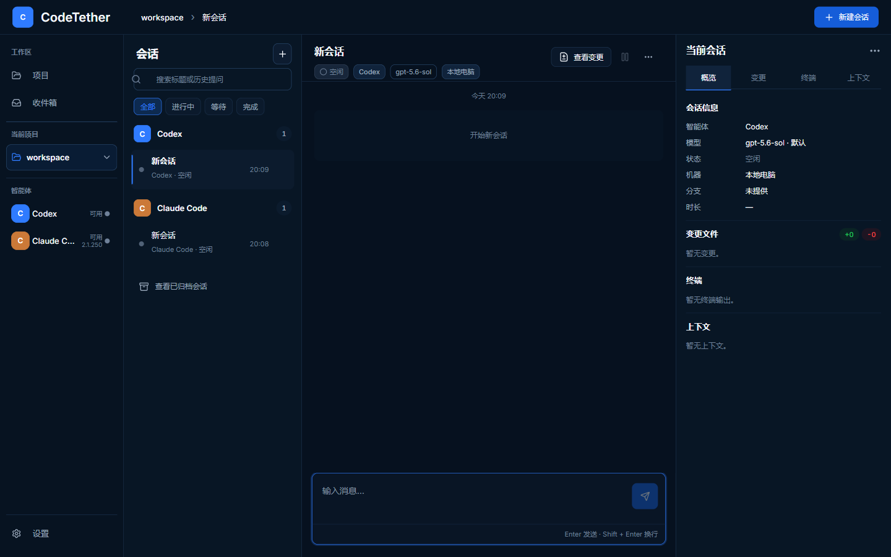
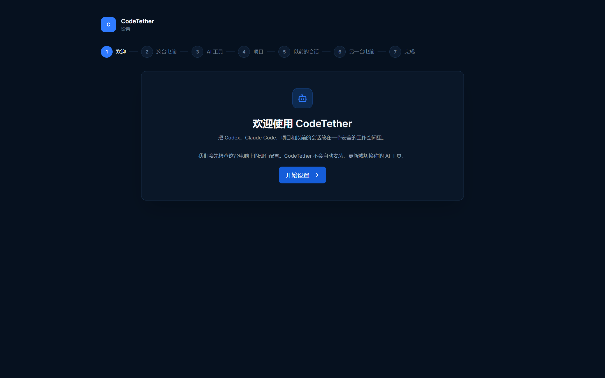
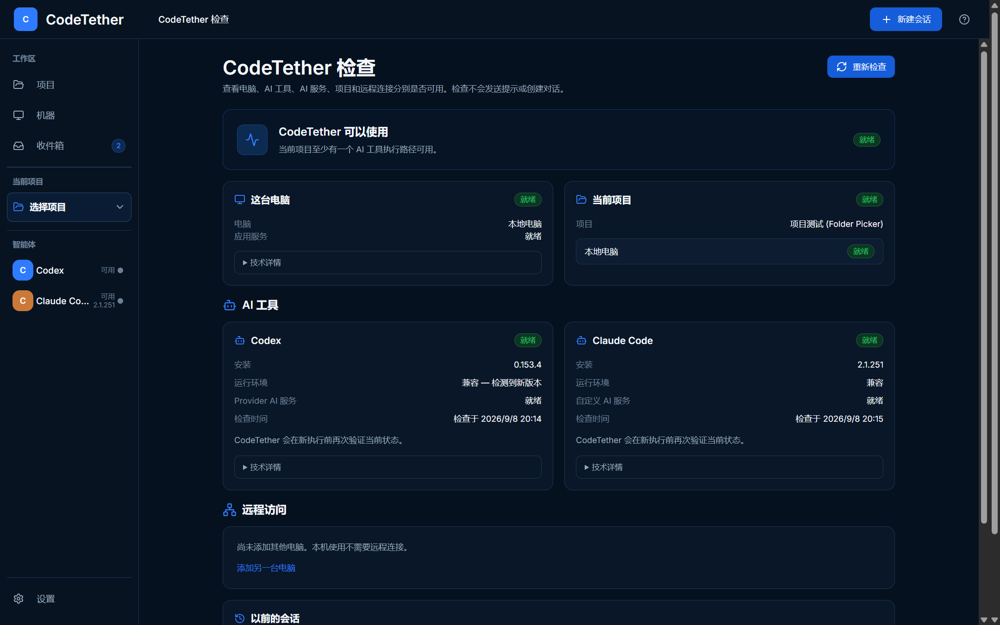
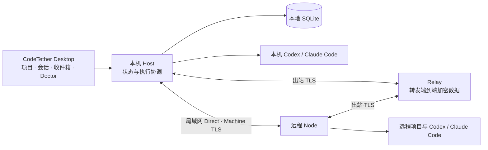

<p align="center">
  
</p>

<h1 align="center">CodeTether</h1>

<p align="center">
  <strong>把 AI 编程 Agent、项目、会话和电脑，放进同一个工作空间。</strong><br />
  A control center for AI coding agents.
</p>

<p align="center">
  Codex · Claude Code · 原生会话续接 · 安全远程 · Onboarding &amp; Doctor
</p>

<p align="center">
  <a href="#核心特色">核心特色</a> ·
  <a href="#开始使用">开始使用</a> ·
  <a href="#平台与发布状态">平台状态</a> ·
  <a href="#从源码开发与构建">开发指南</a> ·
  <a href="#文档导航">详细文档</a>
</p>

---

CodeTether 是面向开发者的 **AI 编程工作区**。它连接你已经安装的 Codex 和 Claude Code，把分散在不同命令行窗口里的项目、会话、执行状态和待处理事项集中起来，让你知道 **谁在工作、在哪台电脑上工作、什么需要你处理，以及如何继续之前的任务**。

它不是一个新的大模型，也不是把所有 Agent 包装成同一种能力的聊天框：实际工作仍由对应的 Agent 在指定电脑和项目中执行，CodeTether 负责组织、展示、控制和安全续接。

> **当前为 Windows-first Alpha。** Windows 桌面核心流程已有真实安装与执行验证；macOS 桌面、macOS Node 和物理 Linux Node 的跨平台发行验证尚未完成。当前没有公开发布的 GitHub 安装包，详见[平台与发布状态](#平台与发布状态)。



_会话工作区的早期 Windows 界面截图，使用隔离测试项目与空会话；用于展示布局，不代表当前版本全部菜单或能力。下方设置与 Doctor 截图来自较新的 Windows 安装版。_

## 为什么需要 CodeTether？

当你同时使用多个 Agent、处理多个项目，或者把任务放在另一台电脑上运行时，真正占用注意力的往往不只是写提示词，还有找会话、确认目录、查看状态和排查连接。

| 你遇到的事情                         | CodeTether 如何帮助你                                      |
| ------------------------------------ | ---------------------------------------------------------- |
| Codex 和 Claude 的会话散在不同窗口里 | 按项目统一组织，保留各自的 Agent 身份与历史                |
| 想继续昨天在 CLI 里开始的工作        | 查找项目已有的原生会话，选择接入后原生续接                 |
| 不知道任务还在运行，还是需要处理     | 流式时间线、明确的执行状态、收件箱与桌面通知               |
| 想从当前电脑控制另一台电脑上的 Agent | 显式安全配对，在远程项目上执行；支持局域网直连与互联网中继 |
| Agent 装好了却不能用                 | Doctor 分开检查电脑、Agent 运行环境、AI 服务、项目和连接   |
| 担心断线后同一个任务被重复执行       | 不自动重发结果不确定的请求，也不偷偷切换 Agent 或执行电脑  |

适合经常使用 AI 编程工具的个人开发者、多项目并行工作者，以及需要管理自己多台开发电脑的用户。

## 核心特色

### 一个工作区，管理多个 Agent 与项目

- **项目与会话一起组织**：会话有明确的项目、Agent 和执行电脑归属。
- **持续可读的执行过程**：查看流式回复，以及当前 Agent 能力范围内的工具活动、变更和审批。
- **找回工作上下文**：重命名、置顶、归档和恢复会话；按项目搜索会话标题和历史提问。
- **关注真正需要处理的事**：收件箱集中展示待审批、已完成待查看和失败待处理事项。
- **桌面后台运行**：Windows 关闭主窗口后保留托盘与后台工作；从托盘重新打开或明确退出。

不同 Agent 和本地/远程执行的能力并不相同，见下方[Agent 能力边界](#agent-能力边界)。

### 继续原来的会话，而不是从头讲一遍

选择项目后，CodeTether 可以查找属于该项目的 Codex / Claude Code 原生会话。你选择要接入的会话，再在 CodeTether 中继续发送新的消息。

```text
在 CLI 中开始的会话
        ↓
CodeTether 查找该项目的历史会话
        ↓
你明确选择接入
        ↓
发送下一条消息，续接原来的 Agent 会话
```

**发现、接入、续接是三个独立动作。** 查找和接入不会调用模型、不会改写原生会话存储，也不会把旧消息重新发送给 Agent。这里的“接入”不是完整历史聊天记录的转换或搬运；原生上下文仍由原来的 Agent 管理，执行电脑也不会改变。

### 本机先用起来，远程按需添加

只想在本机使用 Codex 或 Claude Code？不需要部署远程服务，也不需要配置中继。

需要另一台电脑时，通过“添加另一台电脑”完成显式配对与电脑确认，检查其 Agent，再指定远程项目目录。任务仍在拥有项目的那台电脑上运行，当前桌面用于查看和控制。

- 局域网可使用 **Direct 直连**。
- 互联网可通过 **Relay 中继** 承载端到端加密的机器连接，不要求公开 Node 端口或端口转发。
- 地址变化不等于身份变化；暂时离线不会自动重建信任或重新配对。
- 当前 Alpha 的互联网接入仍需要管理员协助完成中继接入配置，并非一键注册的云服务。

### 引导式设置，沿用已有配置

首次打开时，CodeTether 会检查电脑与已安装的 AI 工具，引导你选择项目、查找以前的会话，再进入工作区。



- Codex 和 Claude Code **可以只装一个**，远程设置与历史会话接入都可以跳过。
- 设置进度持久保存，中途退出后可以继续。
- 检查已安装的工具、版本与兼容性，不在后台安装、升级或切换 Agent。
- 沿用实际生效的认证和 AI 服务配置；使用自定义网关时，不会仅因为它不是官方服务就要求重新登录。
- “应用设置完成”不等于“Agent 已可执行”；缺少工具、认证或就绪证据时会如实说明。

### Doctor：知道哪里出了问题，也知道下一步做什么

**CodeTether 检查（Doctor）** 是常驻的诊断入口，不只是首次安装时的一页提示。



_Windows 安装版、隔离测试项目。图中版本号和就绪状态是截图当时的真实观察，不是固定支持版本或对其他电脑的就绪承诺。_

Doctor 分开回答：

- 这台电脑和应用服务正常吗？
- 选中的 Codex / Claude Code 安装存在、兼容吗？
- AI 服务能用吗，还是需要登录、暂时不可用或尚未检查？
- 项目文件夹仍然可访问吗？
- 远程电脑现在在线，还是只能看到上次的状态？

**“Agent 兼容”和“AI 服务可用”是两回事。** 自定义网关不可用，不会被描述成 Claude 不兼容；另一个可用 Agent 也不会因此被标成不可用。操作以“重新检查”、安装指引、选择文件夹等针对性步骤为主，不提供破坏性的“一键修复全部”。打开 Doctor 不会自动调用模型。

## Agent 能力边界

统一工作区不意味着把各个 CLI 的全部能力都开放出来。实际可用项由当前安装版本、兼容性与执行环境共同决定。

| 执行方式         | 当前接入范围                                                             | 需要注意                                                |
| ---------------- | ------------------------------------------------------------------------ | ------------------------------------------------------- |
| 本地 Codex       | 流式对话、原生续接、工具与变更展示、审批和中断；按能力提供模型与推理设置 | 以当前兼容性检查和界面开放项为准                        |
| 本地 Claude Code | 流式对话、原生续接、Read / Glob / Grep、工具事件与支持的思考强度         | 当前不开放编辑、写入、Shell、Diff、审批、中断或模型选择 |
| 远程 Codex       | 受限的文本流式执行与原生续接                                             | 不开放远程工具、文件修改、Shell 或审批                  |
| 远程 Claude Code | 受限的流式执行、原生续接、读取/搜索与思考强度                            | 不开放远程编辑、Shell、Diff、审批、中断或模型选择       |

同一会话固定属于一个 Agent 和一台电脑；不支持会话内切换 Agent、跨 Agent 移交，或把原生会话迁移到另一台电脑。当前没有接入第三种 Agent。

## 平台与发布状态

**功能验证、可构建和正式平台支持是不同状态。** 下表不把跨平台源码实现当作真实硬件验证。

| 平台 / 组件                 | 当前状态                                                                                               |
| --------------------------- | ------------------------------------------------------------------------------------------------------ |
| Windows x64 Desktop         | 当前主要 Alpha 平台；已有 NSIS 安装、本地执行、设置与 Doctor 的真实验证，Phase 8D 最终发行验证仍在推进 |
| Linux x64 Node              | 既有 Linux / WSL2 远程基础；发行归档与 systemd 用户服务已实现，物理 Linux 最终验证待完成               |
| macOS Apple Silicon Desktop | `.app` / `.dmg` 构建配置已实现；真实 Mac 安装与使用验证待完成，尚不宣称支持                            |
| macOS Apple Silicon Node    | 发行布局与 LaunchAgent 用户服务已实现；真实 Mac 验证待完成                                             |
| Linux ARM64 Node            | 预览目标，构建入口已准备；真实硬件支持未确认                                                           |
| Linux x64 Desktop           | 预览目标，尚无经过完整验证的发行版                                                                     |
| Windows Node / Intel macOS  | 不列入当前已验证的正式发行支持范围                                                                     |
| iOS / Android               | 未来规划，尚未实现                                                                                     |

截至 **2026-09-09**，[GitHub Releases](https://github.com/lyf-workshop/CodeTether/releases) 尚未发布安装包。源码公开不代表已有面向所有用户的发行版；Alpha 安装包也不应被当作已签名、已公证的正式公开发行。

完整平台要求、签名状态、服务安装方式与后续验证清单见 [Phase 8D 跨平台发行文档](docs/PHASE8D-CROSS-PLATFORM-DISTRIBUTION.md)。

## 开始使用

### 已获得 Windows Alpha 安装包

1. **准备 AI 工具**：安装并配置至少一个兼容的 [Codex CLI](https://developers.openai.com/codex/cli/) 或 [Claude Code](https://code.claude.com/docs/en/overview)。安装与登录遵循各自官方指引，CodeTether 不捆绑这些工具。
2. **安装并打开 CodeTether**：安装版自带应用运行所需的 Host，无需为 CodeTether 单独启动终端、Node.js 或开发服务器。
3. **完成检查**：查看工具与 AI 服务状态；有问题时按提示处理，再重新检查。
4. **选择项目文件夹**：使用原生文件夹选择器。项目不强制要求 Git 仓库。
5. **按需接入以前的会话**：选择要继续的原生会话，或者跳过并创建新会话。
6. **开始工作**：选择项目、执行电脑和 Agent，明确发送第一条消息。需要排查时打开设置中的 CodeTether 检查。

无需为了完成设置而发送测试提示词。如果 AI 服务状态仍是“尚未检查”，不要将它理解为已经可执行；后续显式执行的结果会更新实际健康状态。

**日常使用提示：** `Enter` 发送、`Shift + Enter` 换行。关闭 Windows 主窗口会隐藏到托盘，而不是退出；要结束应用及其后台工作，请从托盘选择“退出 CodeTether”。

### 添加远程电脑

在目标电脑准备匹配平台的 CodeTether Node 和其本地 Agent，随后从桌面“添加另一台电脑”进入引导，确认电脑身份，再登记那台电脑上的项目目录。这里不会上传或同步你的整个项目。

当前远程部署属于 Alpha 流程；平台就绪范围、中继管理员协助步骤及用户级服务的安装/启停命令，请先阅读[远程安装与服务说明](docs/PHASE8D-CROSS-PLATFORM-DISTRIBUTION.md#installation-and-user-services)。不要开放公共 Node 端口，也不要把配对信息或凭据贴到 GitHub Issue 中。

## 数据、安全与可靠性

- **工作数据由自己的电脑持有**：项目、会话和执行记录保存在控制端本地 SQLite；远程项目文件和 Agent 原生会话仍属于执行端。
- **凭据留在执行端**：Provider 认证与自定义网关配置不通过中继同步，也不作为普通界面字段展示。
- **中继只负责传输**：机器间业务数据使用端到端 Machine TLS 保护，中继不解密或持久化提示词、Agent 输出、项目内容和原生会话数据。连接身份、时间与流量规模等传输元数据仍可能可见。
- **执行对象明确**：观察、选择和执行对应同一个 Agent 安装，不在失败后偷偷换一个可执行文件。
- **断线不等于重做**：网络恢复可以恢复空闲连接；执行结果不确定的任务不会自动重发，也不会在运行中迁移到另一路连接。
- **故障不抹掉历史**：Agent 暂不可用、电脑离线或项目目录失效时，已保存的会话历史仍可查看。

本地管理数据 **不等于模型离线运行**。你发送的内容及 Agent 需要的上下文仍可能传给所配置的 AI 服务，其数据政策、认证和费用由相应服务决定。CodeTether 也不是能隔离所有恶意 Agent 行为的安全沙箱。

安全设计见 [架构说明](docs/ARCHITECTURE.md) 与 [端到端安全边界](docs/PHASE7C-END-TO-END-SECURITY.md)。

## 工作方式与技术架构

桌面界面负责交互，本机 Host 负责持久状态和执行协调；远程 Node 负责在被授权的项目中执行 Agent。不同 Provider 的原生协议留在各自适配器中。



_Direct 与 Relay 是连接路径，不是两套会话。同一运行中的任务不会跨路径迁移；只使用本机时，不需要右侧的远程组件。_

技术栈：**React 19 · TypeScript · Tauri 2 / Rust · Node.js SEA · SQLite · Tailwind CSS · TanStack Router / Query**。

<details>
<summary>展开查看仓库结构</summary>

```text
apps/
  web/                 共享产品界面
  desktop/             Tauri 桌面、托盘、原生能力与安装包
  host/                本机 API、持久化与执行协调
  node/                远程电脑运行时
  relay/               加密连接的中继服务
  distribution/        跨平台构建、归档、校验与发布清单
packages/
  ui/                  共享设计系统
  protocol/            Web ↔ Host 类型化协议
  client/              HTTP / SSE 客户端
  agent-core/          Provider 无关的运行事件
  adapter-codex/       Codex 适配器
  adapter-claude/      Claude Code 适配器
  machine-transport/   机器间认证与传输
  relay-protocol/      中继协议
  relay-client/        出站中继连接
docs/                  产品、架构、阶段范围与验证要求
```

仓库中的 `adapter-opencode` 只是未来占位，不代表已接入 OpenCode。

</details>

## 从源码开发与构建

以下是**开发者流程**，不是已安装桌面应用的日常使用要求。

### Windows 开发环境

- Git、仓库固定版本的 pnpm（见 `package.json` 的 `packageManager`）。
- 当前 SEA 发行工具链使用 **Node.js 25.8.2**；不能只按普通 Web 项目的最低 Node 版本准备桌面构建环境。
- Rust MSVC 工具链、Microsoft C++ Build Tools、Windows SDK 与 WebView2 Runtime。
- 需要真实执行时，另行准备兼容的 Codex / Claude Code 及其有效认证。

```sh
git clone https://github.com/lyf-workshop/CodeTether.git
cd CodeTether
pnpm install --frozen-lockfile
pnpm desktop:dev
```

`desktop:dev` 会构建 Host sidecar 并启动桌面开发环境。不要在旁边再启动一个独立 Host，否则会发生本地端口冲突。

### 构建与检查

```sh
pnpm typecheck
pnpm lint
pnpm format:check
pnpm build
pnpm test
pnpm desktop:check
pnpm desktop:build
```

Windows NSIS 构建产物位于 `apps/desktop/src-tauri/target/release/bundle/nsis/`。

需要带有统一命名、构建身份与 SHA-256 的发行候选时，在**干净的已提交工作树**运行：

```sh
pnpm release:desktop:windows-x64
```

规范化产物写入 `output/release/<commit>/`。macOS / Linux 的发行命令与原生工具链要求见[发行构建入口](docs/PHASE8D-CROSS-PLATFORM-DISTRIBUTION.md#build-identity-and-release-entry-points)；构建必须匹配目标系统和架构，编译成功不代表平台验证通过。

## 当前边界与后续方向

- **已完成并冻结的产品基础**：安全远程连接、原生会话发现/接入、Agent 生命周期与兼容性、引导式设置和 Doctor（截至 Phase 8C）。
- **正在推进**：Phase 8D 跨平台发行，实施状态为 `IMPLEMENTATION READY FOR REAL PLATFORM VALIDATION`；真实平台验证与最终验收尚未完成，未接受、未冻结。
- **未来规划**：Phase 9 移动端伴侣；尚未开始实现，不是当前可下载功能。
- **明确未提供**：Backend/Profile Manager、多账号或网关切换、自动额度故障转移、Agent 自动安装/升级、远程终端、远程文件管理、云账号与项目同步。

路线图不是已实现功能清单。详细阶段与出口条件见 [ROADMAP](docs/ROADMAP.md)。

## 文档导航

| 想了解什么                         | 文档                                                                  |
| ---------------------------------- | --------------------------------------------------------------------- |
| 产品目标与行为边界                 | [产品说明](docs/PRODUCT.md)                                           |
| 状态归属、协议与安全设计           | [架构说明](docs/ARCHITECTURE.md)                                      |
| 已完成阶段与后续计划               | [路线图](docs/ROADMAP.md)                                             |
| 如何发现和继续已有原生会话         | [会话发现与接入](docs/PHASE8A-EXISTING-SESSIONS.md)                   |
| 安装选择、版本兼容性与 AI 服务状态 | [Provider 生命周期](docs/PHASE8B-PROVIDER-LIFECYCLE.md)               |
| 首次设置、恢复与问题诊断           | [Onboarding 与 Doctor](docs/PHASE8C-ZERO-CONFIG-ONBOARDING-DOCTOR.md) |
| 平台支持、安装包、用户服务和签名   | [跨平台发行](docs/PHASE8D-CROSS-PLATFORM-DISTRIBUTION.md)             |

## 反馈与参与

欢迎通过 [GitHub Issues](https://github.com/lyf-workshop/CodeTether/issues) 反馈使用体验和可复现问题。请附上操作系统、CodeTether 构建版本、Agent 版本、操作步骤与安全的错误代码。

**不要上传** API Key、登录信息、机器私钥、配对/中继令牌、完整数据库、原生会话文件或私人项目内容。截图前请检查项目名、文件路径和对话内容；需要修改产品行为时，请先对照当前阶段范围与 [AGENTS.md](AGENTS.md)。
